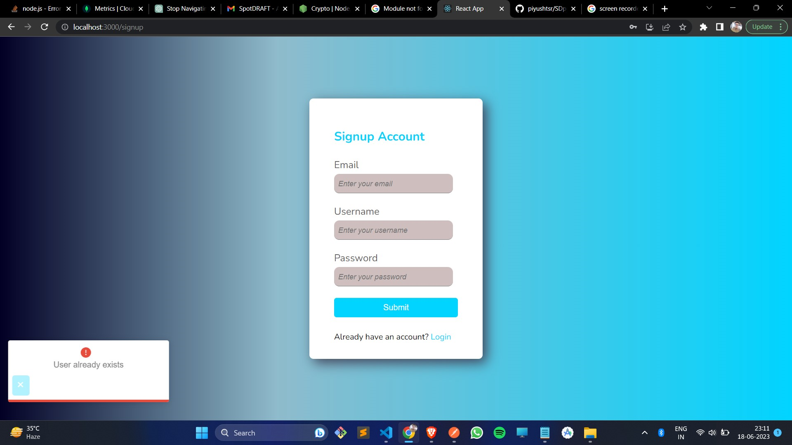
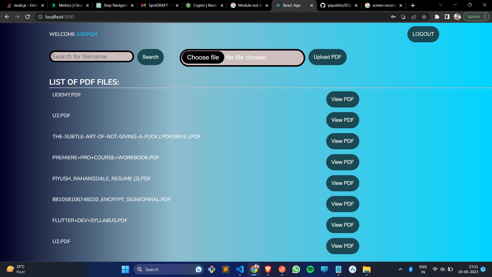
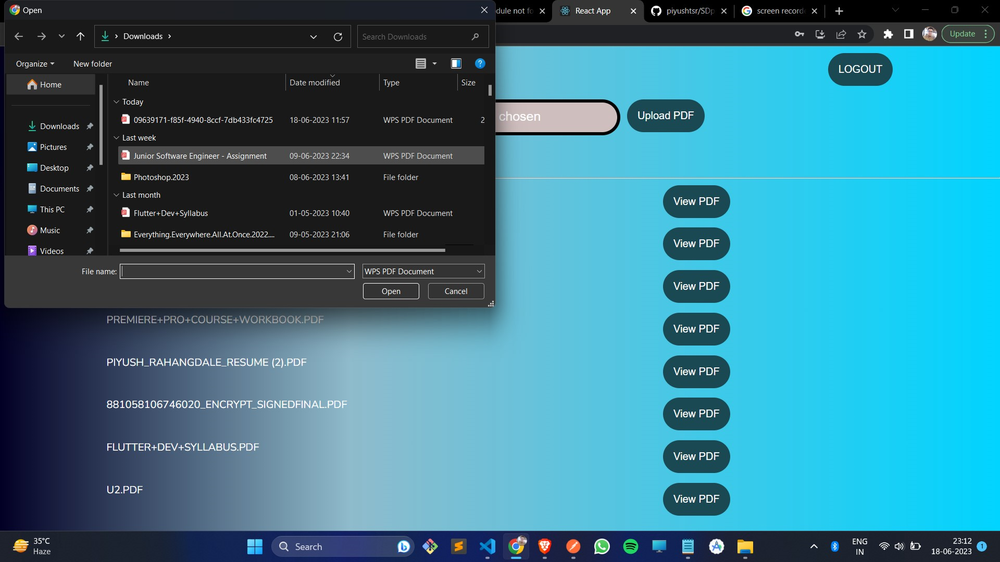
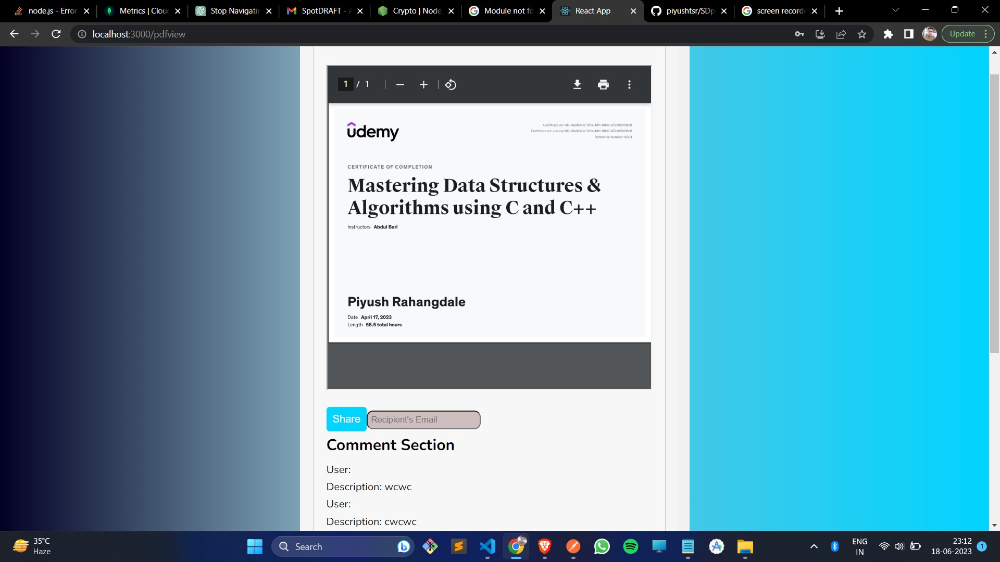
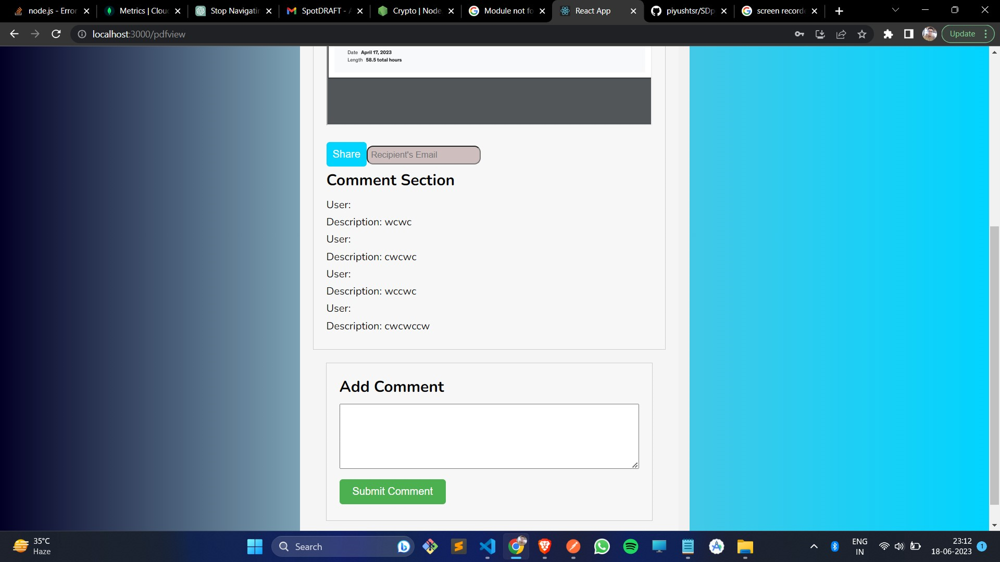
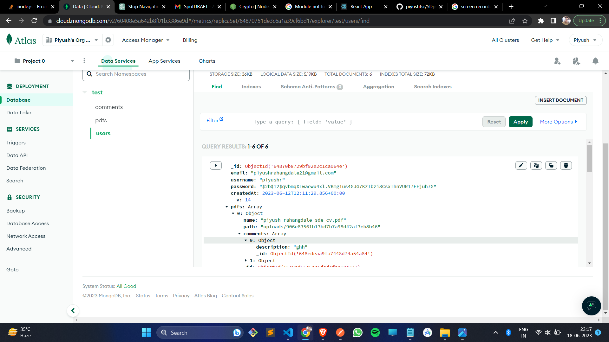

# SDpdfmanager

This MERN web app allow an user to store pdf and share/interact with others

(Disclaimer: This app has many bugs in responsiveness, and some minor bugs, also for now other users cannot comment as the routes are protected.

Similarly, for the case of sending mail, proper research on how to give an anonymous user to have access, needs to be done yet)

- This contains authentication and authorization using jwt with session and refreshtokens
- allwing authenticated user to upload pdf of their choice
- allowing user to add comment to an particular pdf
- share the pdf to another user(on progress...)

Signup with error handling

List of all pdfs that were previously stored and this route is protected

Uploading a pdf

View PDF after clicking View PDF

View and add comments

Cloud database at mongodb atlas

